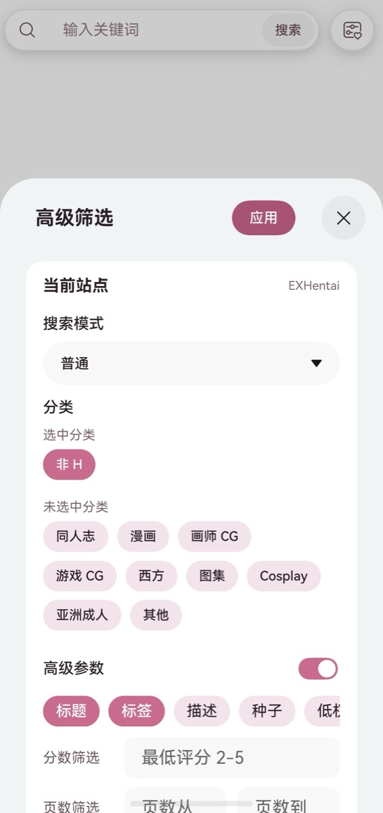
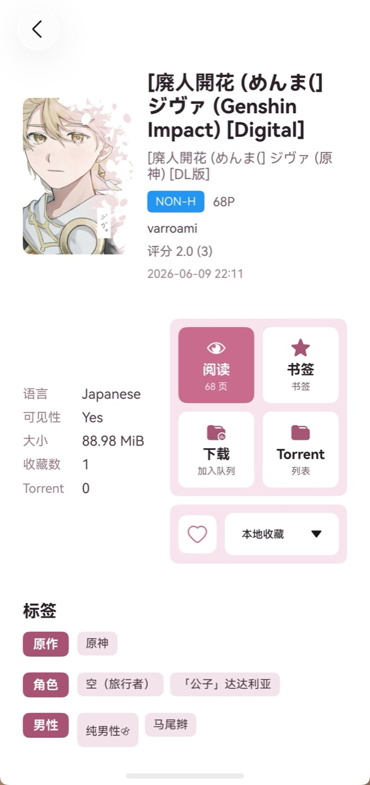
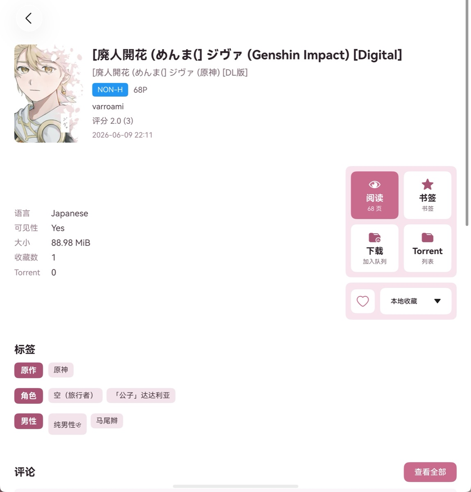
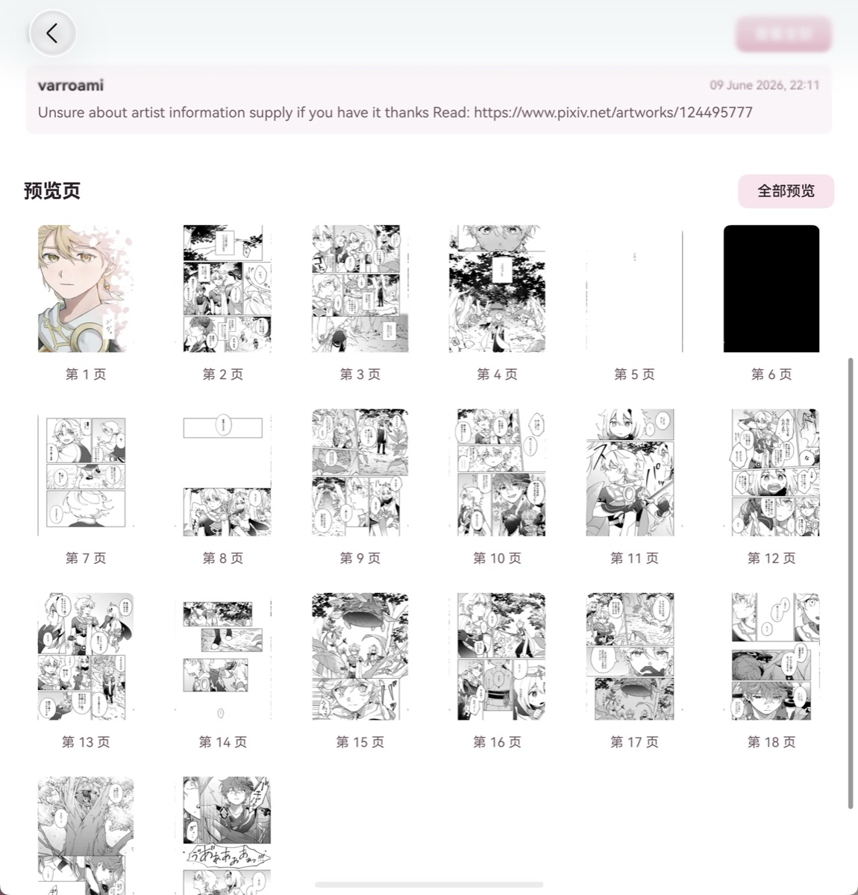

# HarmonyOS-EhViewer / E-Harmony

HarmonyOS-EhViewer（E-Harmony）是一个面向 HarmonyOS NEXT / HarmonyOS 6.1+ 的非官方 E-Hentai / ExHentai 浏览器，使用 ArkTS、ArkUI 和 DevEco Studio 原生开发。

> 项目完全免费，仅供学习交流使用，不提供任何 VPN、代理、网络加速、绕过访问限制或类似服务，请在遵守所在地法律法规与目标站点规则的前提下使用。有问题欢迎在 [Issues](../../issues) 留言。

关键词：HarmonyOS EhViewer、鸿蒙 EhViewer、HarmonyOS NEXT 漫画阅读器、ArkTS E-Hentai client、ExHentai viewer。

## 功能

- E-Hentai / ExHentai 插画、漫画等资源浏览
- 原生列表、详情、阅读和下载界面
- Web 登录与 Cookie 同步
- 收藏、本地收藏、搜索历史和快捷搜索
- 标签翻译、标签搜索与关键词联想
- 阅读进度记录、继续阅读和重新阅读入口
- App 锁定、面容/指纹/锁屏密码验证与后台预览保护
- HarmonyOS 深浅色资源与基础备份配置

## 更新记录

### 1.0.5 (2026-06-30)

- 更新下载页为“已下载 / 下载中”双页签，已下载支持瀑布流展示，下载中保留任务列表和进度控制。
- 修复下载状态恢复、进度条、暂停任务统计、通知更新和通知点击回到下载中页面的问题。
- 优化未登录和游客模式：收藏页、详情页默认只使用本地收藏，云端收藏夹登录后才显示。
- 修复登录提醒关闭行为，点击游客模式或弹窗外部不再刷新回首页，里站未登录时自动切回外站。
- 优化下载历史加载态、本地账号缓存保留、瀑布流弹性滚动和登录弹窗图标显示。
- 移除正式界面的模拟器调试代理入口，保留系统代理能力。

### 1.0.3 (2026-06-24)

- 新增“我的 - 设置 - 隐私保护”，支持锁定 App，进入前台时使用面容、指纹或锁屏密码验证，默认关闭。
- 新增后台预览隐私保护开关，默认开启。
- 详情页会根据阅读器退出时页码显示“继续阅读”和“从 xx 页”，并提供重新阅读入口。
- 整理 ArkTS 文件结构，拆分隐私、设置解析、阅读进度和通用工具模块。

### 1.0.1 (2026-06-22)

- 修复搜索联想和历史记录浮层位置异常、滚动后不可见或遮挡底部导航的问题。
- 修复搜索页刚打开、从详情页返回瀑布流时联想/历史框误自动弹出的问题。
- 修复点击联想或历史记录后继续输入，需要再次点击搜索框才会出现下一轮联想的问题。
- 修复从详情页返回瀑布流时回到顶部，而不是恢复到原位置的问题。
- 修复详情页点击标签进入搜索后，标签格式与联想标签不一致、高级筛选项不生效的问题。
- 优化瀑布流分页加载和底部导航区域的滚动留白表现。

## 界面展示

界面会根据窗口宽度与设备形态调整布局：手机竖屏优先保证单手浏览与双列信息流；双折叠屏会展开详情、预览和阅读空间；三折叠屏与平板等宽屏比例会展示更多列内容，适合横向浏览和快速筛选。

### 手机竖屏

<p align="center">
  
  
  
</p>

<p align="center">
  <sub>搜索瀑布流、高级筛选和详情操作会在竖屏宽度下保持紧凑排版。</sub>
</p>

### 双折叠屏

<p align="center">
  
  
</p>

<p align="center">
  
</p>

<p align="center">
  <sub>宽屏下详情信息、操作按钮、预览列表和阅读区域会展开，减少来回切换。</sub>
</p>

### 三折叠屏 / 平板

<p align="center">
  
</p>

<p align="center">
  <sub>三折叠屏和平板等更宽比例会展示更多内容列，适合横向浏览与快速比较。</sub>
</p>

## 安装与构建

可以在 [Releases](../../releases) 页面直接下载安装包，并使用 [HoKit](https://github.com/yabi-zzh/HoKit) 进行安装。

也可以从源码自行构建。本项目使用 HarmonyOS / DevEco Studio 工程结构。

```sh
hvigor assembleHap --mode module -p product=default -p buildMode=release --no-daemon
```

未签名 HAP 通常会生成在：

```text
entry/build/default/outputs/default/entry-default-unsigned.hap
```

公开仓库不包含签名配置、证书、密钥或本地构建凭据。自行安装时，请使用自己的 HarmonyOS 签名材料。

## 声明

- 本项目不是 E-Hentai、ExHentai 或 EhViewer 官方项目。
- 本项目不托管、不分发、不代理任何 E-Hentai / ExHentai 内容。
- 本项目不内置、不提供、不推荐任何 VPN 或代理服务。
- 使用者应自行确认所在地法律法规、目标站点规则及账号使用风险。

## 致谢

本项目的灵感来自 [seven332/EhViewer](https://github.com/seven332/EhViewer)，并参考了 [xiaojieonly/Ehviewer_CN_SXJ](https://github.com/xiaojieonly/Ehviewer_CN_SXJ) 的功能形态与使用体验。

标签翻译与关键词联想功能使用了 [xiaojieonly/EhTagTranslation](https://github.com/xiaojieonly/EhTagTranslation) 的标签翻译数据，并保留了 [Mapaler/EhViewer](https://github.com/Mapaler/EhViewer) 的标签翻译数据源作为备用更新来源。

感谢上述项目及其贡献者对 E-Hentai 浏览器生态的长期维护。

## 许可

本项目源码采用 [Apache License 2.0](LICENSE) 开源。

内置标签翻译数据 `entry/src/main/resources/rawfile/tag-translations-zh-rCN` 及其在线更新数据遵循其上游数据源声明的 [CC-BY-NC-SA-3.0](https://creativecommons.org/licenses/by-nc-sa/3.0/) 协议；相关数据仅可在该协议允许的范围内使用。
